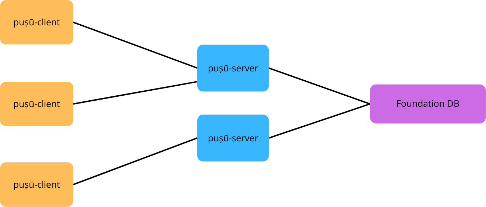

# Plushy (PubSub as Service)

Plushy is a distributed PubSub FoundationDB layer mimicking
the [Redis PubSub](https://redis.io/docs/latest/develop/interact/pubsub/)
but adding a tenant isolation leveraged by the [Biscuit](https://www.biscuitsec.org/) authentication/authorisation
token.

## Project overview

### Components

The Plushy project is divided in multiple crates, each one with their own purpose:

- [plushy-server-lib](plushy-server-lib) : Handle the communication with the FoundationDB cluster
- [plushy-server](plushy-server) : Listen to plushy-client connections
- [plushy-client-lib](plushy-client-lib) : Programmatic client
- [plushy-client](plushy-client) : CLI client
- [plushy-protocol](plushy-protocol) : Describes the protocol between client and server

### Relations between components

Each `plushy-server` of a same cluster shared the same FoundationDB as storage endpoint.

`plushy-server` are fully stateless components, they only hold a transient client session which can be relaunched
in an another `plushy-server` instance. This architecture allows a horizontal-scaling preventing any trafic burst.

`plushy-server` instances are meant to be used behind a load-balancer.

`plushy-client` on its own, can be either some embedded library in another program, or the plushy-client CLI.

`plushy-client` connects to any `plushy-server` and starts the communication using
the [plushy-protocol](plushy-protocol).

